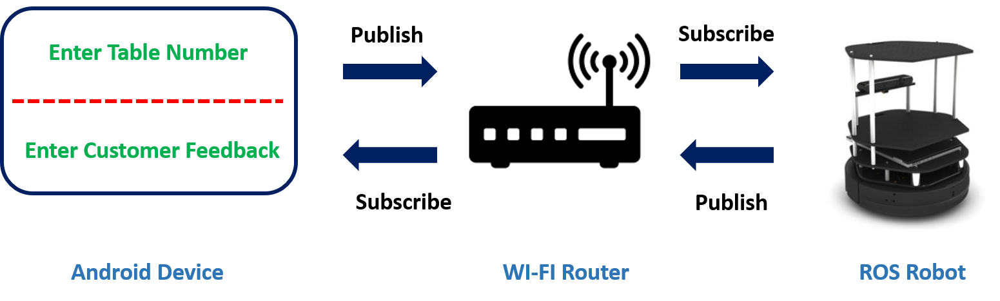

# Autonomous-Food-Delivery-Robot_ROS
The project is done at University of Alberta (UoA) for the course CMPUT 412: Experimental Robotics.

## Overview
In this project, an autonomous food delivery robot capable of delivering customer orders entered from an Android phone app will be created. After completion of the food delivery, the robot waits for the customer feedback. After the robot receives the customer feedback, the robot will respond by playing a music based on the feedback it receives. Then the robot returns to its charging station. The food delivery robot is capable of navigating a cluttered restaurant space environment by dynamically re-planning a path from charging station to customer table and back, while avoiding obstacles in the process.

## Dependencies
Project is tested on the following environment.
* Ubuntu 14.04
* Python 2.7.6
* ROS Indigo
* Numpy
* OpenCV-Python 2.4.8
* Java 8
* ROS-Java GradleVersion 2.2.1
* Android Studio 3.0.1

## Background and Motivation
Automated restaurant or robot restaurant is a restaurant that uses robots to partially or completely automate their services. This technology started in the early 1970s, where a number of restaurants served food through vending machines. Recently, this technology has evolved to robots performing food preparation, orders, delivery, cleanup and billing. Restaurants and cafes in Japan, China, India and US have demonstrated the feasibility of robot performing such tasks. Furthermore, some of the restaurants have reported increase in productivity while also entertaining customers with this technology.

Motivated by the increase in productivity, where one robot can oversee multiple jobs accurately and efficiently, as well as the entertainment the robot brings when interacting with the customer, these will add to improve the overall customer experience. 

## Goals
1. Develop a proof-of-concept food delivery system capable of delivering orders to customers.
2. Create an Android app to transmit and receive data from ROS.
3. Use a map for autonomous collision free navigation to travel between two locations on the map.

## Specifications
*	Robot must be able to communicate to and from the Android phone app.  
*	Robot can navigate from its charging station, to the customer specified table area, and back to the charging station. 
*	Robot can dynamically re-plan its path when it detects new obstacles in the map. 
*	Robot can play different music based on the feedback it receives.
*	Robot can carry a maximum payload of 5 kg on hardwood floor, and 4 kg on carpet floor. 

## Project Modules
### Map of "restaurant" space
The CS north end floor space will simulate a restaurant space environment. The map will show the locations of the customer tables and charging station. 

  

### Android-ROS communication and robot navigation
Install Java, ROS-Java and Android Studio to setup the ROS-Android interface on the PC and generate the APK files. Some unexpected difficulties came up around installing the right versions to establish the Android-ROS communication, so follow the versions indicated in the dependencies above. The Android app will have two activities. It will ask the user to enter a table number and provide a feedback based on the service the user received. The table numbers are assigned as waypoints for the robot to travel to. Once the robot arrives at the waypoint, it waits for the customer feedback, and plays different music based on the feedback it receives.

  

(VIDEO: android_ros_comm_travel)

### Docking
After the robot receives its feedback, it will travel back to its charging station, and accurately docks for battery charging. 

(VIDEO: docking)

### Dynamic path planning
#### Method 1: DWA_Local_Planner
#### Method 2: SBPL_Dynamic_Planner
