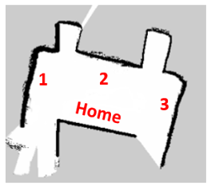
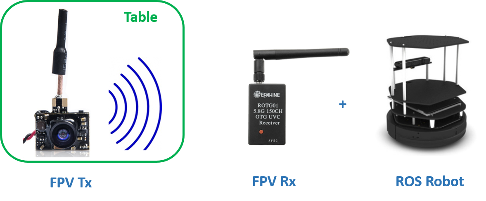
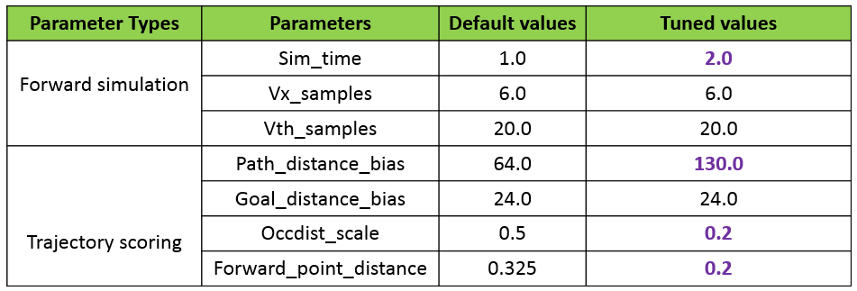
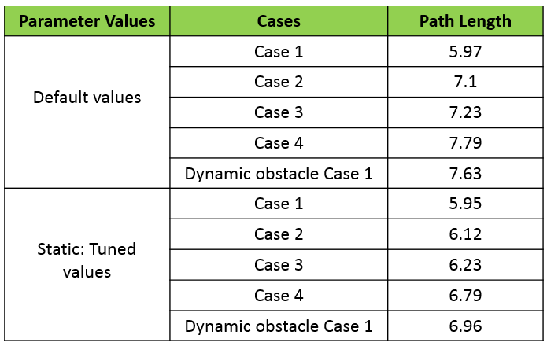
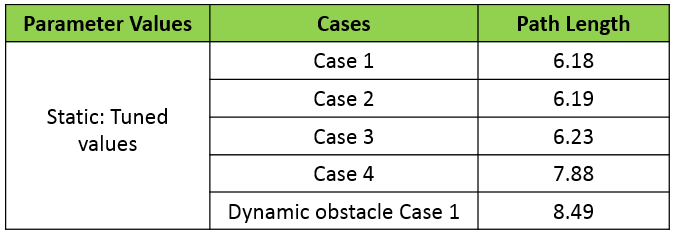

# Autonomous-Food-Delivery-Robot_ROS
The project is done at University of Alberta (UoA) for the course CMPUT 412: Experimental Robotics.

## Overview
In this project, an autonomous food delivery robot capable of delivering customer orders through an FPV camera transceiver setup will be created. Alternatively, an Android phone app can be designed for customers to enter the orders. This was the initial approach, but due to the lack of documentation on the integration of ROS and Android, and the time constraint on this project, instead the FPV camera approach is implemented. After completion of the food delivery, the robot returns to its home location. The food delivery robot is capable of navigating a cluttered restaurant space environment by dynamically re-planning a path from home location to customer table and back, while avoiding obstacles in the process.

## Dependencies
Project is tested on the following environment.
* Ubuntu 14.04
* Python 2.7.6
* ROS Indigo
* Numpy
* OpenCV-Python 2.4.8


## Background and Motivation
Automated restaurant or robot restaurant is a restaurant that uses robots to partially or completely automate their services. This technology started in the early 1970s, where a number of restaurants served food through vending machines. Recently, this technology has evolved to robots performing food preparation, orders, delivery, cleanup and billing. Restaurants and cafes in Japan, China, India and US have demonstrated the feasibility of robot performing such tasks. Furthermore, some of the restaurants have reported increase in productivity while also entertaining customers with this technology.

Motivated by the increase in productivity, where one robot can oversee multiple jobs accurately and efficiently, as well as the entertainment the robot brings when interacting with the customer, these will add to improve the overall customer experience. 

## Goals
1. Develop a proof-of-concept food delivery system capable of delivering orders to customers.
2. Setup the FPV Camera transceiver to remotely transmit, receive and recognize images from ROS. 
3. Use a map for autonomous collision free navigation to travel between two locations on the map.

## Specifications
*	Robot must be able to communicate to and from Laptop using the FPV camera transceiver.   
* Robot must be able to detect and process images obtained from the FPV camera transceiver.  
*	Robot can navigate from its home location, to the customer specified table area, and back to the home location. 
*	Robot can dynamically re-plan its path when it detects new obstacles in the map. 
*	Robot can play different music based on the feedback it receives.
*	Robot can carry a maximum payload of 5 kg on hardwood floor, and 4 kg on carpet floor. 

## Project Modules
### Map of "restaurant" space
The CS north end floor space will simulate a restaurant space environment. The map will show the locations of the customer tables and home location. 

<div align="center">
  
</div>

### FPV-ROS communication and robot navigation
A First-Person View (FPV) camera is used to remotely transmit images to and from ROS. Alternatively, an IP camera or any wireless camera can be used, the FPV camera is used here because it was the available hardware. Ideally, an FPV camera will be placed at each customer table, the customer will enter the order, place the order in-front of the FPV camera for image transmission, and the robot will process the transmitted image to recognize the order. With this approach, it can provide convenience for the customers as it does not require a smart-phone nor the need to download an app.

But in order to utilize the FPV camera, the laptop's webcam must be working. This has been a persisting problem from a previous project, where the laptop's webcam can't be detected. The initial approach to resolve this issue was to install different versions of kernels. When Kernel 3.13 was installed, the webcam worked but sound and internet was lost. Then after some more search, [this](https://askubuntu.com/questions/762254/why-do-i-get-required-key-not-available-when-install-3rd-party-kernel-modules?utm_medium=organic&utm_source=google_rich_qa&utm_campaign=google_rich_qa) was the solution. It turns out that for laptops with dual boot (Ubuntu/Microsoft), microsoft requires all drivers to be signed before they can be used. Ubuntu does not sign the drivers by default. Therefore, even if the drivers are installed, the drivers are still unrecognized. In short, the solution is to disable secure boot.

#### FPV Hardware
The FPV transceiver consists of the Eachine Tx05 Mini FPV Camera and the Eachine ROTG01 FPV Receiver. Some important specifications for the transceiver are:

*	Operating voltage: 3.3 – 5.5 V 
*	Operating current: 150 mA – 800 mA  
*	Frequency: 5.8 GHz, 300 MHz of bandwidth
*	Range 400 m

<div align="center">
  
</div>

#### Character recognition
The character recognition is performed with the KNN (K-Nearest Neighbor) algorithm, which is part of the supervised learning algorithms that can be applied to applications such as: data mining, statistical pattern recognition and image processing. The KNN algorithm here for character recognition is carried out in two steps. Step 1: Generate the data set, with different font types, in a format readable by python. Step 2: Train the program with the dataset generated from step 1.

Since this is a proof-of-concept food delivery system, one FPV transmitter and receiver will be used, and the following images will be processed for character recognition. Where T1, T2 and T3 indicate table numbers 1, 2 and 3, respectively. Where Happy Birthday indicates it’s a customer’s birthday. Then by entering T1, T2 and T3, the robot will head to the corresponding table, since the table numbers are assigned as waypoints for the robot to travel to. Furthermore, by entering B1 (or B2, B3), the robot will head to the corresponding table then play a happy birthday song. 

<div align="center">
  
</div>


<div align="center">
  <a href="https://www.youtube.com/watch?v=sRaQAqGH1SI"></a>
</div>

### Dynamic path planning
Dynamic path planning describes the robot's ability to perceive the environment, react rapidly to unforeseen obstacles, and re-plan dynamically in order to complete a task. The former is usually referred to as local path planning while the latter is often referred to as global path planning. The Navfn/Global global planners and DWA local planner are studied and compared to determine the appropriate method to implement. 

#### Method 1: NAVFN_Global_Planner and DWA_Local_Planner
The navfn global path planner trajectory is computed based on the Dijkstra algorithm.

Using a map, the kinematics trajectory with the Dynamic Window Approach (DWA) is created by periodically performing a forward simulation from the robot's current state to predict what would happen if the sampled velocity were applied for a short time. Since the robot only considers the velocities that can be reached within the next short time frame, these velocities from the dynamic window. Hence the name DWA_Local_Planner. Furthermore, multiple trajectories are created. Each trajectory is evaluated based on an objective function:

objective = path_distance_bias * (distance to path from the endpoint of the trajectory in meters) + goal_distance_bias * (distance to local goal from the endpoint of the trajectory in meters) + occdist_scale * (maximum obstacle cost along the trajectory in obstacle cost)

The objective function incorporates the metrics of proximity to end goal, proximity to local goal, and proximity to obstacles. Also, the objective function shows the tradeoff between the robot's desire to move fast towards the end goal, and its desire to move around obstacles. The highest cost function (highest score) is picked to set the next steering command. Repeat these steps to re-calculate the next steering command.  

The following parameters will be tuned to understand their effects on the performance of this algorithm: 
* forward simulation(sim_time/vx_samples/vth_samples)
* trajectory scoring(path_distance_bias/goal_distance_bias/occdist_scale/forward_point_distance). 

The performance of this algorithm is assessed based on comparison of the generated trajectory and path length when moving against different types of dynamic and static obstacles. The dynamic obstacle is where one obstacle moves to interfere the end-goal position. The four types of static obstacles are:
* Case 1) No obstacle obstructing the end-goal position
* Case 2) One obstacle obstructing the end-goal position
* Case 3) Two obstacles in contact and obstructing the end-goal position
* Case 4) Obstacles in contact forming a wall and obstructing the end-goal position

A simulation with turtlebot_in_stage simulator is performed in RVIZ. The generated global path trajectory is shown in green. The path length is calculated by subscribing to the pose topic. The static obstacles are simulated by creating new maps using GIMP. The dynamic obstacle is added by entering a velocity attribute, as mentioned [here](http://playerstage.sourceforge.net/doc/stage-cvs/group__model.html). The dynamic obstacle properties are: pose(5.0 2.0 0.0 0.0), velocity(2.0 0.0 0.0), size(1.0 1.0 1.5). 

The forward simulation parameters are tuned first. It is observed that an increase in sim_time results in a decrease in path length and an increase in path accuracy as the turtlebot does not fluctuate over the map in search for the correct path. It is observed that an increase in the vx_samples and vth_samples does not have significant affect on the path length. The trajectory scoring parameters are tuned next. It is observed that an increase in path_distance_bias results in a decrease in path length as the robot stays closer to its global path. It is observed that the goal_distance_bias at 24.0 yields a low path length, any value higher or lower results in a longer path length. It is observed that a decrease in occdist_scale can result in the robot getting stuck by an obstacle as it is allowed to be very close to the obstacle, while an increase in occdist_scale can result in a longer path as the robot stays far away from the obstacle. It is observed that a decrease in forward_point_distance results in an increase in simulation time as the robot continuously checks the score to the global goal. The final tuned values and resulting path lengths from simulation are illustrated in the following tables.    

<div align="center">
  
</div>

<div align="center">
  
</div>

<div align="center">
  <a href="https://www.youtube.com/watch?v=LGjvdUReWsc"></a>
</div>

<div align="center">
  <a href="https://www.youtube.com/watch?v=8GYKUG_Zfuk"></a>
</div>


#### Method 2: Global_Planner and DWA_Local_Planner
The Global Planner is a refactoring of the Navfn package. The Global planner is based on the A* algorithm that calculates and uses the minimal Manhattan distance to find the global path. The Navfn planner is based on the Dijkstra's algorithm that calculates and uses the minimal Eucliedan distance to find the global path. According to [here](https://answers.ros.org/question/28366/why-navfn-is-using-dijkstra/) and [here](http://sbpl.net/node/50), the A* algortihm usually has a better performance in terms of computational time and cost than Dijkstra due to its ability to use heruistics. However, A* can result in less-optimal paths. The path length results are shown below. Overall, the navfn performs better in a cluttered environment, thus will be used.      

<div align="center">
  
</div>

To use global_planner, do the following in move_base:
```
<nodepkg="move_base" type="move_base" respawn="false"name="move_base" output="screen">

 <param name="base_global_planner"value="global_planner/GlobalPlanner"/>
```

## Performance Video
When the robot recognizes the characters transmitted via FPV camera, it will act accordingly by either travelling to the corresponding waypoint or play a happy birthday song after travelling to the corresponding waypoint, and then back to its home location. Furthermore, based on the simulation results the navfn global path planner will be used with the dwa local path planner, along with the tuned parameters for dynamic path planning. The following scenarios will be tested:

* No obstacle obstructing the end-goal position
* One obstacle at different locations obstructing the end-goal position
* Moving obstacle obstructing the end-goal position

### Video 1: Real time character recognition with view angle 1
<div align="center">
  <a href="https://www.youtube.com/watch?v=jXstzUVtUa0"></a>
</div>

### Video 2: Real time character recognition with view angle 2
<div align="center">
  <a href="https://www.youtube.com/watch?v=Sat9whLExqo"></a>
</div>

### Video 3: Real time character recognition with moving obstacle
<div align="center">
  <a href="https://www.youtube.com/watch?v=VPVe31jVV-E"></a>
</div>

## Discussion
The power supply shown in the video can be replaced by a battery circuit design that outputs 5 V to make the FPV transceiver portable. Only the one obstacle and moving obstacle simulation scenarios are tested in real-world turtlebot, and shows it's capable of immediately replanning a new path towards the goal position.  

## Acknowledgment
* Programming Robots with ROS
* [Eachine Tx05 Mini FPV Camera ](https://www.banggood.com/Eachine-TX05-0_0152550100250mW-Switchable-w-OSD-AIO-5_8G-72CH-VTX-600TVL-NTSC-Mini-FPV-Camera-p-1181013.html?cur_warehouse=USA)
* [Eachine ROTG01 FPV Receiver](https://www.banggood.com/Eachine-ROTG01-UVC-OTG-5_8G-150CH-Full-Channel-FPV-Receiver-For-Android-Mobile-Phone-Smartphone-p-1147692.html?cur_warehouse=USA)
* [KNN Character Recognition](https://github.com/MicrocontrollersAndMore/OpenCV_3_KNN_Character_Recognition_Python)
* [The Dynamic Window Approach to Collision Avoidance](https://ieeexplore.ieee.org/document/580977/)
* [A Comparison of Path Planning Algorithms for Omni-Directional Robots in Dynamic Environments](https://ieeexplore.ieee.org/document/4133821/)


