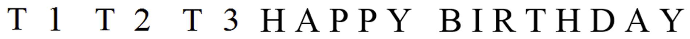

# Autonomous-Food-Delivery-Robot_ROS
The project is done at University of Alberta (UoA) for the course CMPUT 412: Experimental Robotics.

## Overview
In this project, an autonomous food delivery robot capable of delivering customer orders through an FPV camera transceiver setup will be created. Alternatively, an Android phone app can be designed for customers to enter the orders. This was the initial approach, but due to the lack of documentation on the integration of ROS and Android, and the time constraint on this project, instead the FPV camera approach is implemented. Nevertheless, the documentation on the installation of ROS and Android can be found in the repository here. After completion of the food delivery, the robot returns to its charging station. The food delivery robot is capable of navigating a cluttered restaurant space environment by dynamically re-planning a path from charging station to customer table and back, while avoiding obstacles in the process.

## Dependencies
Project is tested on the following environment.
* Ubuntu 14.04
* Python 2.7.6
* ROS Indigo
* Numpy
* OpenCV-Python 2.4.8

## Background and Motivation
Automated restaurant or robot restaurant is a restaurant that uses robots to partially or completely automate their services. This technology started in the early 1970s, where a number of restaurants served food through vending machines. Recently, this technology has evolved to robots performing food preparation, orders, delivery, cleanup and billing. Restaurants and cafes in Japan, China, India and US have demonstrated the feasibility of robot performing such tasks. Furthermore, some of the restaurants have reported increase in productivity while also entertaining customers with this technology.

Motivated by the increase in productivity, where one robot can oversee multiple jobs accurately and efficiently, as well as the entertainment the robot brings when interacting with the customer, these will add to improve the overall customer experience. 

## Goals
1. Develop a proof-of-concept food delivery system capable of delivering orders to customers.
2. Setup the FPV Camera transceiver to remotely transmit, receive and recognize images from ROS. 
3. Use a map for autonomous collision free navigation to travel between two locations on the map.

## Specifications
*	Robot must be able to communicate to and from Laptop using the FPV camera transceiver.   
* Robot must be able to detect and process images obtained from the FPV camera transceiver.  
*	Robot can navigate from its charging station, to the customer specified table area, and back to the charging station. 
*	Robot can dynamically re-plan its path when it detects new obstacles in the map. 
*	Robot can play different music based on the feedback it receives.
*	Robot can carry a maximum payload of 5 kg on hardwood floor, and 4 kg on carpet floor. 

## Project Modules
### Map of "restaurant" space
The CS north end floor space will simulate a restaurant space environment. The map will show the locations of the customer tables and charging station. 

  

### FPV-ROS communication and robot navigation
A First-Person View (FPV) camera is used to remotely transmit images to and from ROS. Alternatively, an IP camera or any wireless camera can be used, the FPV camera is used here because it was the available hardware. Ideally, an FPV camera will be placed at each customer table, the customer will enter the order, place the order in-front of the FPV camera for image transmission, and the robot will process the transmitted image to recognize the order. With this approach, it can provide convenience for the customers as it does not require a smart-phone nor the need to download an app. 

The FPV transceiver consists of the Eachine Tx05 Mini FPV Camera and the Eachine ROTG01 FPV Receiver. Some important specifications for the transceiver are:

*	Operating voltage: 3.3 – 5.5 V 
*	Operating current: 150 mA – 800 mA  
*	Frequency: 5.8 GHz, 300 MHz of bandwidth
*	Range 400 m

  

Since this is a proof-of-concept food delivery system, one FPV transmitter and receiver will be used, and the following images will be processed. Where T1, T2 and T3 indicate table numbers 1, 2 and 3, respectively. Where Happy Birthday indicates it’s a customer’s birthday. Then by entering T1, T2 and T3, the robot will head to the corresponding table, since the table numbers are assigned as waypoints for the robot to travel to. Furthermore, by entering Happy Birthday T1 (or T2, T3), the robot will head to the corresponding table and sing happy birthday. 

  

(VIDEO: recognize letters via FPV camera)
(VIDEO: travel to waypoints)

### Docking
After the robot receives its feedback, it will travel back to its charging station, and accurately dock for battery charging. (Use if docking inaccurate: At the docking station is an AR tag. An AR tag is used to compensate any pose offset, since docking requires precise pose.)

(VIDEO: docking)

### Dynamic path planning
This is the most challenging part of the project. Dynamic path planning describes the robot's ability to perceive the environment, react rapidly to unforeseen obstacles, and re-plan dynamically in order to complete a task. Two local methods (unlike global methods which have high computational complexity) with available ROS packages are studied and compared to determine the appropriate method to implement.

#### Method 1: DWA_Local_Planner
Using a map, the kinematics trajectory with the Dynamic Window Approach (DWA) is created by periodically performing a forward simulation from the robot's current state to predict what would happen if the sampled velocity were applied for a short time. Since the robot only considers the velocities that can be reached within the next short time frame, these velocities from the dynamic window. Hence the name DWA_Local_Planner. Furthermore, multiple trajectories are created. Each trajectory is evaluated based on an objective function:

objective = path_distance_bias * (distance to path from the endpoint of the trajectory in meters) + goal_distance_bias * (distance to local goal from the endpoint of the trajectory in meters) + occdist_scale * (maximum obstacle cost along the trajectory in obstacle cost)

The objective function incorporates the metrics of proximity to end goal, proximity to local goal, and proximity to obstacles. Also, the objective function shows the tradeoff between the robot's desire to move fast towards the end goal, and its desire to move around obstacles. The highest cost function (highest score) is picked to set the next steering command. Repeat these steps to re-calculate the next steering command.  

The following parameters will be tuned to understand their effects on the performance of this algorithm: 
* velocity (max_vel_x/max_trans_vel)
* rotation(max_rot_vel)
* acceleration(acc_lim_x)
* forward simulation(sim_time/vx_samples/vtheta_samples)
* trajectory scoring(path_distance_bias/goal_distance_bias/occdist_scale/forward_point_distance/scaling_speed/max_scaling_factor). 

The performance of this algorithm is assessed based on comparison of the generated trajectory and path length when moving against different types of dynamic and static obstacles. The dynamic obstacle is where one obstacle moves to interfere the end-goal position. The four types of static obstacles are:
* Case 1) No obstacle obstructing the end-goal position
* Case 2) One obstacle obstructing the end-goal position
* Case 3) Two obstacles in contact and obstructing the end-goal position
* Case 4) Obstacles in contact forming a wall and obstructing the end-goal position

A simulation with turtlebot_in_stage simulator is performed in RVIZ. The generated global path trajectory is shown in green. The path length is calculated by subscribing to the pose topic. The static obstacles are simulated by creating new maps using GIMP. The dynamic obstacle is added by entering a velocity attribute, as mentioned [here](http://playerstage.sourceforge.net/doc/stage-cvs/group__model.html).

The parameters have been tuned ... (See table)
The path lengths for each case ... (See table)

(IMG TABLE: parameters tuned)

(IMG TABLE: path lengths)

(VIDEO: before parameters tuned, default values)

(VIDEO: after parameters tuned)

#### Method 2: SBPL_Dynamic_Planner
The DWA approach treats dynamic obstacles as static and constantly re-plans as dynamic obstacles moves. However, this often sacrifices path optimality and completeness. For example: the robot could have crossed but instead it just waited until the obstacle has passed; the robot takes a longer path around the obstacle. This is mainly because the DWA approach only considers a state-space of (x, y, theta). This can be overcomed by adding a time dimension to the state-space (x, y, theta, time_interval), to properly perform path planning dynamic environments. This is the basis of the SBPL approach. 

Using a map, the kinematics trajectory of the dynamic object 

## Acknowledgment
* Programming Robots with ROS

